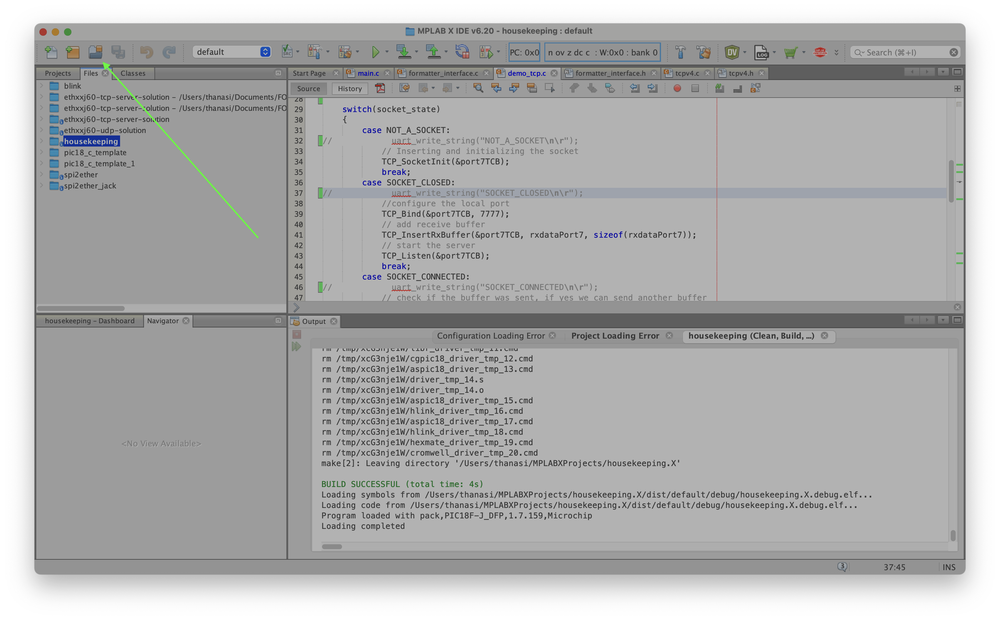
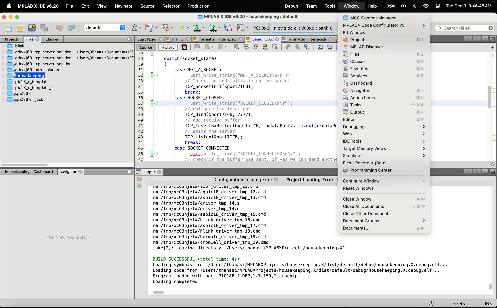
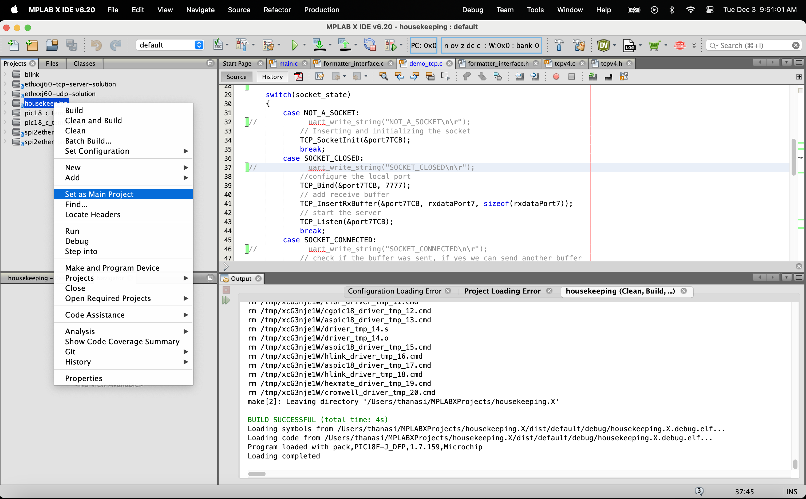
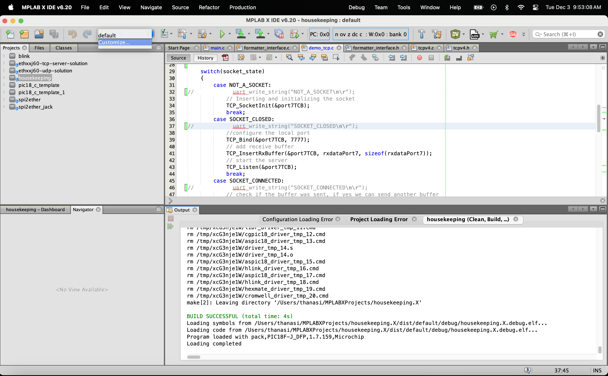
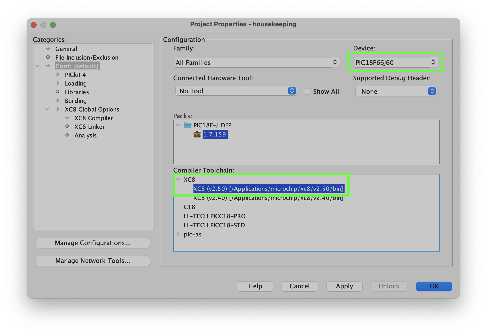
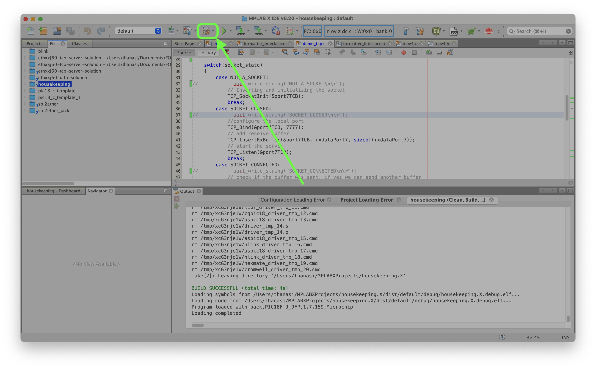
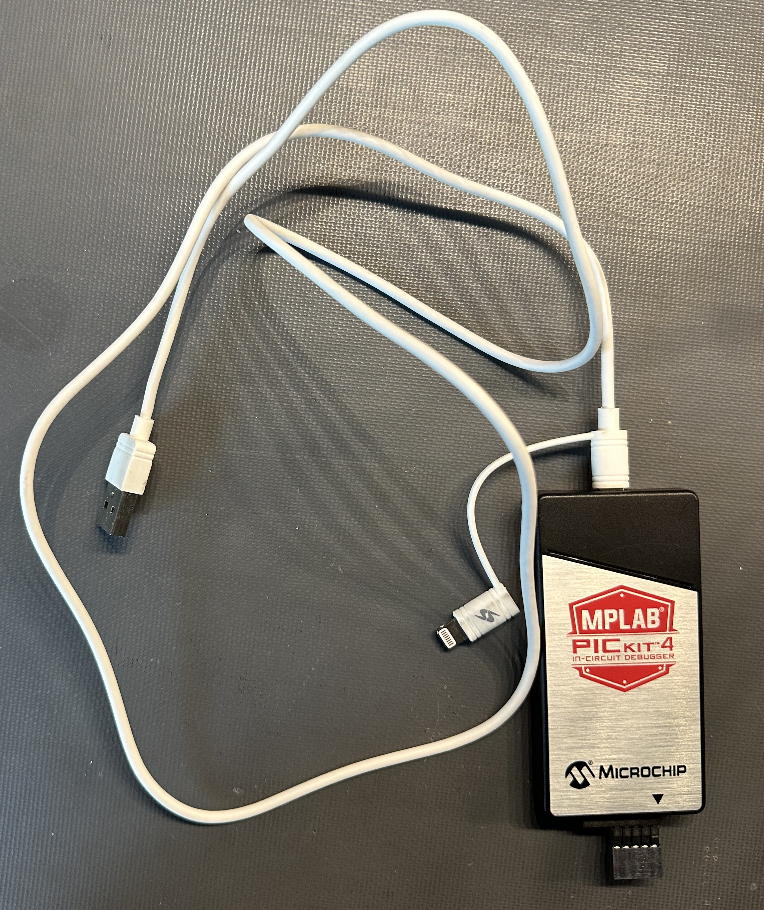
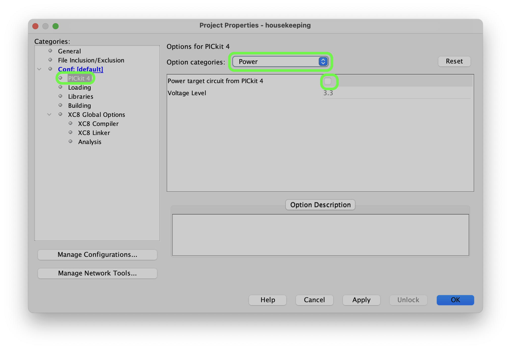
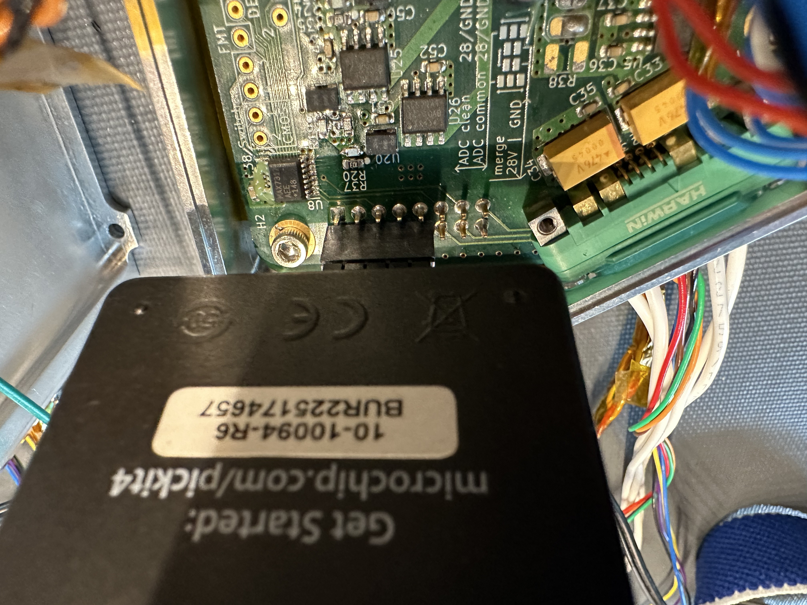
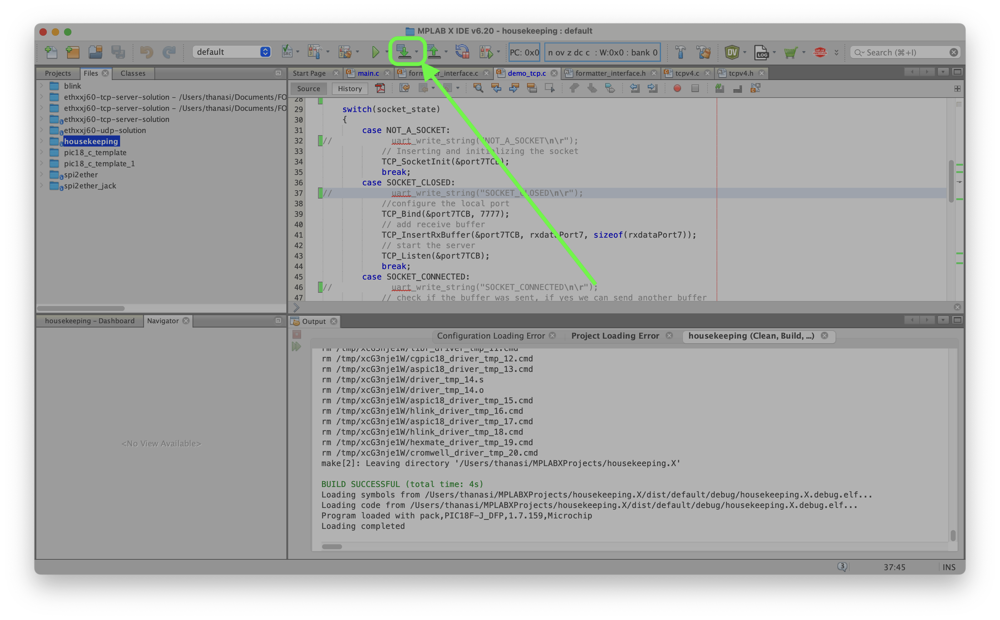

# `foxsi4-hk`
Software for the FOXSI Housekeeping board. This board was also called "plenum" and "Etc" at earlier points in its development, so you may find those names around too.

## Physical design
The FOXSI-4 Housekeeping PCB was designed in [KiCad](https://www.kicad.org/). The design files are [here](https://github.com/foxsi/UMN-boards-FOXSI-4/tree/main/plenum).

The microcontroller at the core of this board is [Microchip's PIC18F66J60](https://ww1.microchip.com/downloads/en/DeviceDoc/39762f.pdf).

## Build guide

### Setting up the IDE
To modify and build this code you will need to install [MPLAB X IDE](https://www.microchip.com/en-us/tools-resources/develop/mplab-x-ide) and the [XC8 compiler](https://www.microchip.com/en-us/tools-resources/develop/mplab-xc-compilers). 

By default (on macOS at least) the MPLAB IDE will look for projects in `~/MPLABXProjects/`. So let's put this stuff there to build it.

```bash
cd ~/MPLABXProjects/
git clone https://github.com/foxsi/foxsi4-hk.git
```

All the MPLAB projects are in folders named `project_name.X`, so let's rename ours too:
```bash
mv foxsi4-hk foxsi4-hk.X
```

Now open up the MPLAB IDE. Once the application opens, click the Open Project button and find the folder we just `git clone`'d:


It should show up as a folder called "housekeeping" in the MPLAB Files browser (see above screenshot). 

If you don't see a Files browser, enable it under the Window top ribbon menu:


Also enable the Projects browser while you're on that ribbon dropdown.

Now in the Projects browser, you will need to set `housekeeping` as the main project:


### Building
Now we can build the software. Click the project configuration dropdown and select Customize...


In the window that opens, type in the microcontroller part number (`PIC18F66J60`) and select the version of the XC8 compiler you installed:
.

Now apply your changes and close the little configuration window. Back in the big IDE window, click the Build Clean icon to try building the software:
.

If the dropdown opens, just pick Clean and Build Main Project (don't build for debugging or PRO comparison).

During build, a terminal at the bottom of the screen should display build progress concluding in a triumphant `BUILD SUCCESSFUL` message. Should.

This produces a .hex file that we need to load into the microcontroller.

## Programming the hardware
An external USB device called the [PicKit](https://www.microchip.com/en-us/development-tool/pg164140) is need needed to program the microcontroller on the Housekeeping board. It looks like this:



Connect the USB end to your computer. Your computer should recognize a USB device. In MPLAB, we will need to configure this tool. Return to the project configuration dropdown and select Customize...


Select the PicKit 4 menu item on the left, then change the Option categories dropdown to select Power. If checked, uncheck the box to Power the target circuit. You will need to power the Housekeeping board separately for programming the microcontroller. 

> [!NOTE]
> It is possible and perfectly safe to power the Housekeeping board using the PicKit, so feel free to select that option in the future. Just make sure you are plugging the PicKit into the Housekeeping header correctly and you are not also powering the board independently from a power supply. Use 3.3 V power in the PicKit settings.

Connect the PicKit to the Housekeeping board like this:


It looks like this in real life:


Note that the Power board stacks on top of the Housekeeping board and shares the same header that the PicKit plugs into. 

Once the PicKit is plugged into your computer, configured, and plugged into the Housekeeping board, you can power on the Housekeeping board.

Then use this button to program the Housekeeping board:


If the dropdown menu comes out, pick the Make and Program Device menu item. You will see terminal printout about how much microcontroller memory was used if this was successful. The software will run any time the Housekeeping board is powered on.

If programming the board went well, you should be able to plug an Ethernet into the Housekeeping board and `ping` it from another computer. The Housekeeping board has IP address 192.168.1.16, and will expect TCP connections from the Formatter to port 7777 (for commanding and Housekeeping data transfer). These addresses are reflected in [foxsi4-commands/systems.json](https://github.com/foxsi/foxsi4-commands/blob/main/systems.json).


## Pitfalls
Just a list of random issues I've encountered on the way.
- The Housekeeping board cannot do [autonegotiation](https://en.wikipedia.org/wiki/Autonegotiation). That means if you have a bare Ethernet port, like one integrated in the Mac Studio, and you plug a cable from that port straight into the Houskeeping board's Ethernet port, they will not be able to communicate. 
  - Instead, you need to plug one side into a USB-C to Ethernet converter (then connect that to the Mac Studio), or connect both systems via an Ethernet switch or hub. Or wire a custom crossover Ethernet cable (don't do this).
  - These intermediate devices like a switch, hub, or USB-C converter *can* do autonegotiation.
- The Housekeeping software is [bad at reading housekeeping data](https://github.com/foxsi/foxsi-4matter/issues/62). Particularly RTD data. Sorry. It's good at sending power commands to the power board though!

## Other tools
- You can use [`ptui`](https://github.com/foxsi/general-tools/tree/main/general-tools-cpp/hk/power/ptui) from the [`general-tools`](https://github.com/foxsi/general-tools) repository to command the power board (via Housekeeping) and display live power data. Helpful if you're working remotely over SSH!